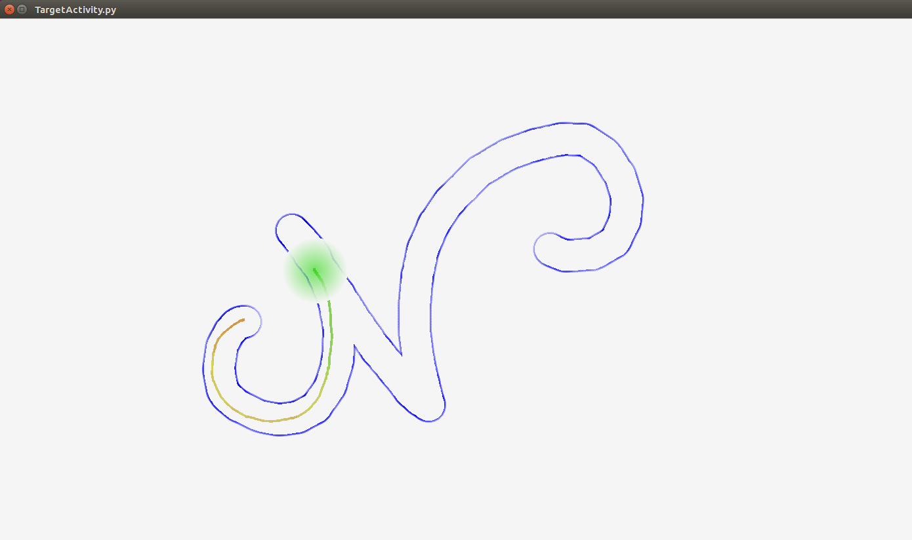
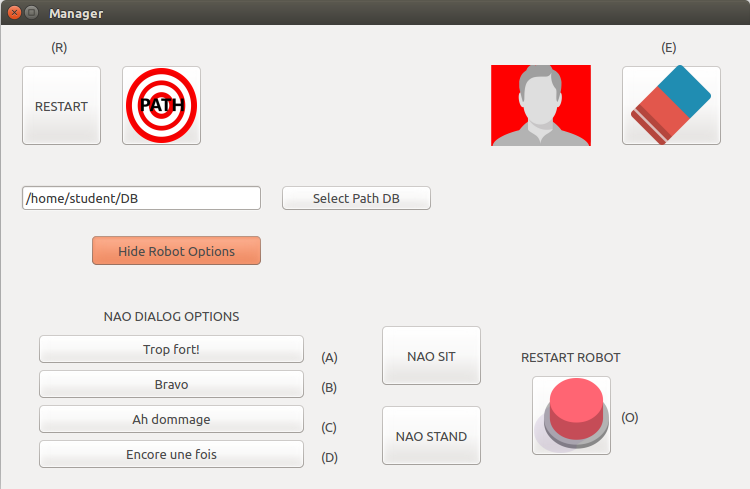
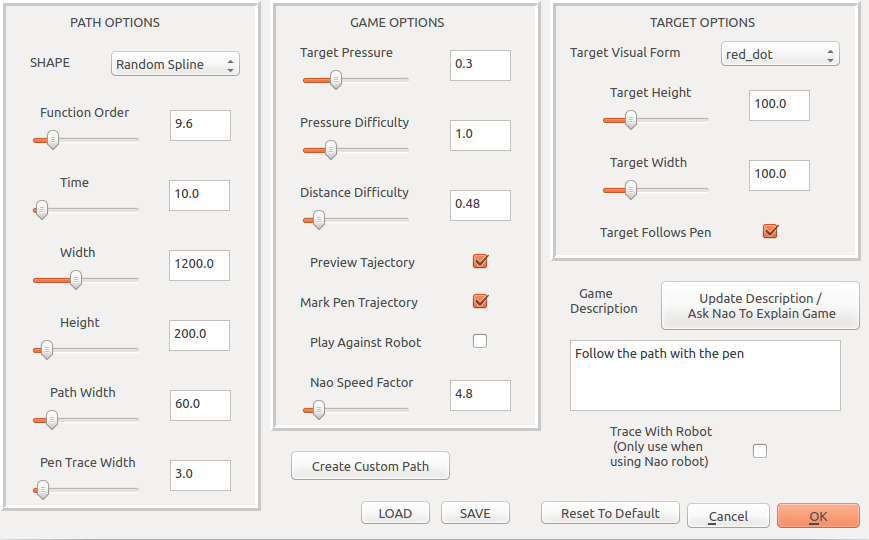
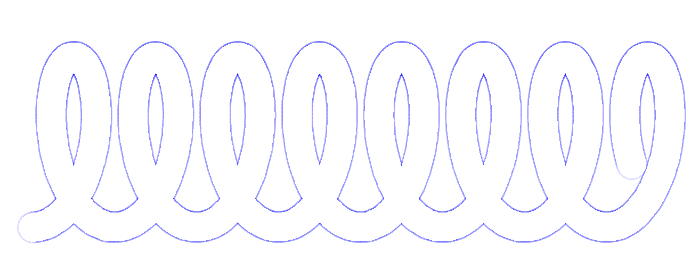
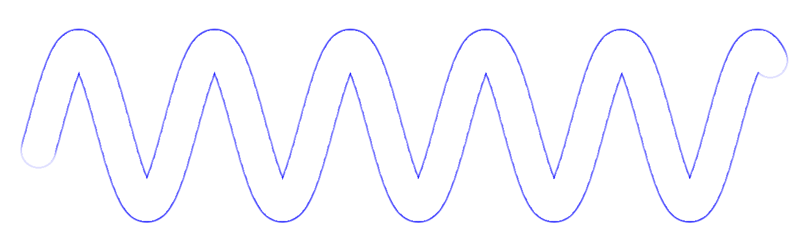
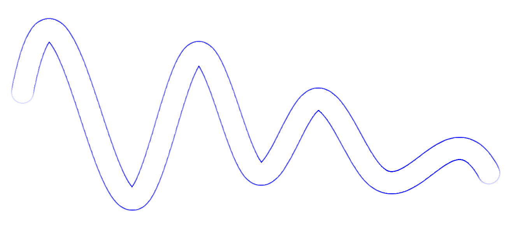
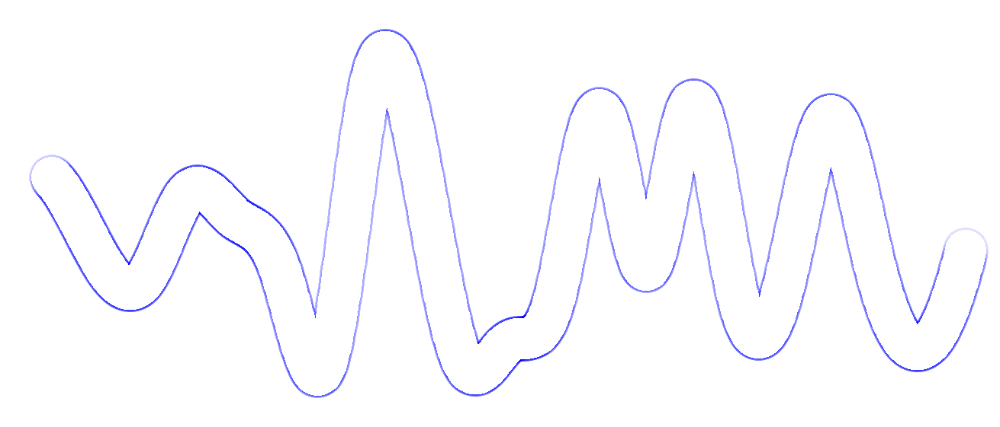
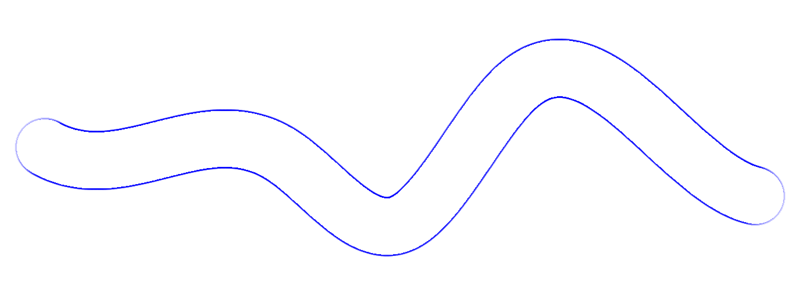
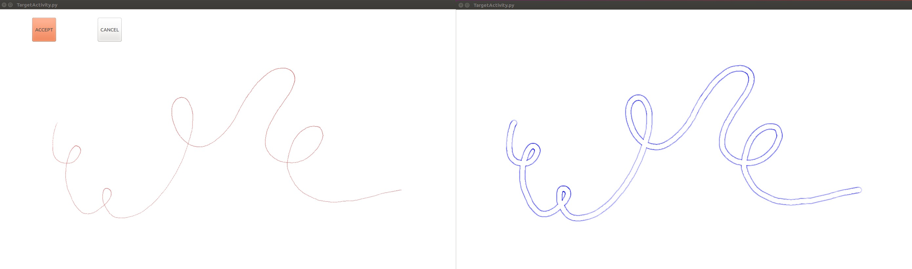
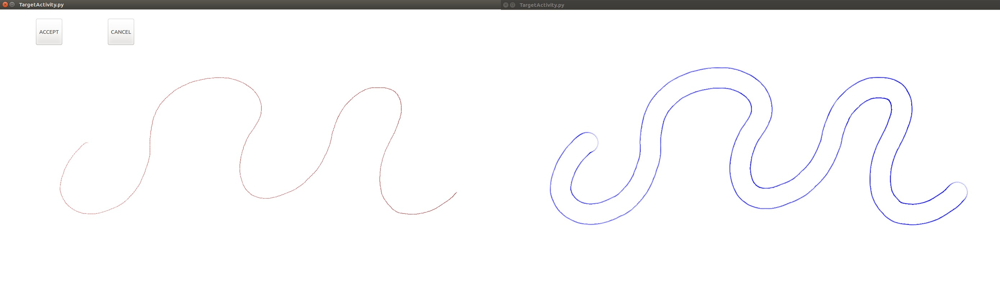

# cowriter_path_following
===========================

This package contains a set of nodes that are used to manage the tablet interface for the path following activity, as well as nodes to control the robot behavior.

Tested with ROS Kinetic on Ubuntu 16.04 (LTS)

Install & Compile:
---------------
```
$ cd ~/catkin_ws/src/
$ git clone  https://github.com/chili-epfl/cowriter_path_following.git
$ cd ../
$ catkin_make
```

Running the app without a robot:
---------------
Run `cowriter_path_following/nodes/TargetActivity.py`to launch the writing app. 


Running the app with a connected robot (real or simulated):
-----------------------------
Make sure you have a ROS Master running (or run `roscore` in a new terminal). 
```
$ roslaunch cowriter_path_following launch.launch nao_port:=... nao_ip:=... [...other options]

```
Then Run `cowriter_path_following/nodes/TargetActivity.py robot`. The 'robot' argument is necessary for the app to run as a ROS node to communicate with the robot.

Provided functionalities:
-----------------------------
The app opens two windows, one for writing and one to manage the parameters

Tablet Tactile Surface
------
The white canvas for the child to draw on.




Manager view
------
 


Allows you to control the activity and set the parameters. It is open on a separate window so that it can be used on a different screen. This interface presents all the necessary options for creating the path and controlling the robot's actions. 
The upper part contains the main buttons for the tablet applications:
- Erase Button: At the top right. Erases everything on the tablet canvas (i.e. path and pen trace).
- Restart button: At the top left. Erases only the pen trace and leaves the same path on the tablet screen.
- Child Profile Button: Opens a window that allows the instructor to fill in the child info (i.e. name, age, gender...). Once this info is given, the application starts to automatically acquire and save all the data from the child's drawings.
- Path Button: Opens the window to create a new path.
- The Database path and the button to change it. This indicates where the collected child data will be saved.

The lower part contains all the robot control buttons (this part is hidden if the robot is not in use, i.e. when running app whithout robot):
- Robot Dialog Options: Clicking any of these will send a signal to the robot that will make say the given phrase. 
- Sit and Stand Buttons: Allow the instructor more control over the robot posture to better adapt to a given spatial arrangement.
- Restart Robot Button: Halts the robot's movement and reinitializes it. This is meant to be used in case the robot behaves unexpectedly.
- Hide Robot Options Button: Hides the robot control buttons.


Path Parameters Window
------


Opens from the Manager View by pressing the Path Button. Lets you specify all the parameters of the activity. It is divided into 3 main sections.
- Path Options: this section contains all the parameters related to the path itself. The function order is the name given the path creation parameter that controls the number of loops in a spiral for example. The time parameter indicates the time it takes for both the target to go threw the pass (if the child has to follow the target) and for the robot to trace the path. The rest of the parameters are self explanatory.
- Game Options: this section deals with the parameters of the activity. Target pressure indicates the pressure value that the child should aim to maintain. The pressure difficulty indicates how close the child has to be to the target pressure to get a positive feedback (i.e. the target and pen trace become green). The distance difficulty does the same thing but for the distance to the target center (only used when the child has to follow the target). The other parameters give the choice of whether or not to show the path (can only be unchecked when the child has to follow the target), to mark the pen trace (i.e. show what the child is drawing), to play against the robot (race to the end of the path against the a Nao head drawing) and if so control the speed of the Nao head with the Nao speed factor.
- Target Options: this small section allows for the modification of the size and form of the target, as well as the choice of whether the target follows the path or the pen.
Aside from these sections, there is a button to tell the robot to explain the activity (i.e. the game) and update the description of the activity on the interface (in the white box below the button). There is also the 'trace with robot' option which indicates whether or not the robot will pretend to be the one drawing the path, this will only work if the robot is in use, and if the robot is in use but is not in a good state to execute the motion this option will send a request to the robot to change its state. All that is left is a few buttons for opening the canvas for custom path creation, loading and saving the parameters, resetting to the default parameters, as well as the 'ok' and 'cancel' buttons.

Path Shapes
------
The path shape is the first path parameter to set, it defines the global shape of the path.

Basic options: Ellipse, spiral, sinusoid, vertical line, horizontal line.


Special Options:
- Random Spline: draws a randomly generated smooth path (smoothness depending on the function order).




-Custom: Lets you draw any arbitrary shape and transforms it into a path.


